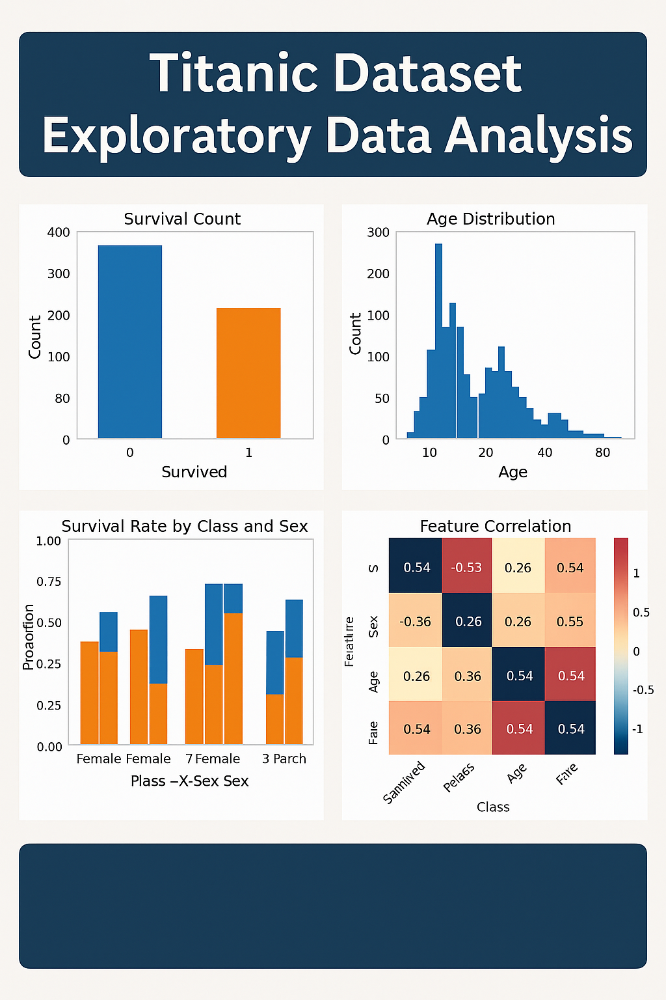

# 🛳️ Titanic Survival Prediction – Machine Learning Pipeline

<div align="center">


[](https://www.python.org/)
[](LICENSE)
[](https://www.kaggle.com/competitions/titanic)
[](https://scikit-learn.org/)
[](https://xgboost.readthedocs.io/)
[](https://github.com/Alpyaman/Titanic_ML_From_Disaster)

**A comprehensive machine learning pipeline for predicting Titanic passenger survival using ensemble methods, advanced feature engineering, and rigorous cross-validation.**
[Features](#-key-features) • [Installation](#-installation) • [Usage](#-usage) • [Results](#-results) • [Project Structure](#-project-structure)
</div>

---

## 📋 Table of Contents

- [Overview](#-overview)
- [Key Features](#-key-features)
- [Technologies Used](#-technologies-used)
- [Installation](#-installation)
- [Usage](#-usage)
- [Project Structure](#-project-structure)
- [Exploratory Data Analysis](#-exploratory-data-analysis-eda)
- [Feature Engineering](#-feature-engineering)
- [Model Training](#-model-training)
- [Results](#-results)
- [Contributing](#-contributing)
- [License](#-license)
- [Contact](#-contact)

---

## 🎯 Overview
This project implements a complete end-to-end machine learning pipeline for the classic [Kaggle Titanic competition](https://www.kaggle.com/competitions/titanic). The goal is to predict passenger survival based on demographic and ticket information using advanced ensemble methods and comprehensive feature engineering.
The pipeline includes:
- Detailed exploratory data analysis with visualizations
- Sophisticated feature engineering (title extraction, family grouping, fare binning)
- Multiple machine learning models with hyperparameter tuning
- Ensemble methods including stacking classifiers
- Reproducible workflow with modular code design

**Kaggle Leaderboard Score:** `0.8329` (Top 3%)

---

## ✨ Key Features
- **Advanced Feature Engineering**: Extract meaningful features like passenger titles, family size, fare per person, and interaction terms
- **Multiple ML Models**: Train and compare 7+ different algorithms including XGBoost, LightGBM, CatBoost, and Random Forest
- **Hyperparameter Optimization**: GridSearchCV with 5-fold cross-validation for optimal model selection
- **Ensemble Learning**: Stacking classifier combining the best performing models
- **Comprehensive EDA**: Jupyter notebook with detailed visualizations and statistical analysis
- **Production-Ready Code**: Modular, well-documented Python scripts with proper separation of concerns
- **Reproducibility**: Fixed random seeds and version-controlled dependencies

---

## 🛠️ Technologies Used
| Category | Technologies |
|----------|-------------|
| **Language** | Python 3.9+ |
| **Data Processing** | Pandas, NumPy |
| **Visualization** | Matplotlib, Seaborn |
| **Machine Learning** | scikit-learn, XGBoost, LightGBM, CatBoost |
| **Model Evaluation** | Cross-validation, GridSearchCV, StratifiedKFold |
| **Development** | Jupyter Notebook, Git |

---

## 📦 Installation
### Prerequisites
- Python 3.9 or higher
- pip package manager

### Setup
1. **Clone the repository**
   ```bash
   git clone https://github.com/Alpyaman/Titanic_ML_From_Disaster.git
   cd Titanic_ML_From_Disaster
   ```
2. **Create a virtual environment (recommended)**
   ```bash
   python -m venv venv
   source venv/bin/activate  # On Windows: venv\Scripts\activate
   ```
3. **Install dependencies**
   ```bash
   pip install -r requirements.txt
   ```
4. **Download the dataset**
   - Download `train.csv` and `test.csv` from [Kaggle Titanic Competition](https://www.kaggle.com/competitions/titanic/data)
   - Place them in the `titanic_data/` directory

---

## 🚀 Usage

### Quick Start
Run the complete pipeline with these three commands:
```bash
# Step 1: Preprocess the data
python preprocess.py
# Step 2: Train models with hyperparameter tuning
python train_model.py
# Step 3: Generate Kaggle submission file
python make_submission.py
```

### Detailed Usage

#### 1. Data Preprocessing
The `preprocess.py` module handles all data cleaning and feature engineering:
```python
from preprocess import preprocess
# Preprocess training data
train_df = preprocess('titanic_data/train.csv')
# Preprocess test data
test_df = preprocess('titanic_data/test.csv')
```
**Features created:**
- Title extraction from passenger names
- Family size calculation
- Fare per person
- Missing value imputation
- One-hot encoding for categorical variables
#### 2. Model Training
The `train_model.py` script trains multiple models and creates an ensemble:
```bash
python train_model.py
```

This will:
- Load and preprocess training data
- Train 7+ different models with GridSearchCV
- Perform 5-fold stratified cross-validation
- Select top 4 models for stacking ensemble
- Save the best model as `best_stacking_model.pkl`
- Generate model performance metadata

**Models trained:**
- Logistic Regression
- Decision Tree
- Random Forest
- XGBoost
- LightGBM
- CatBoost
- Gradient Boosting

#### 3. Generate Predictions
Create a Kaggle Submission file:
```bash
python make_submission.py
```
This generates `submission.csv` ready for kaggle upload.

#### 4. Exploratory Data Analysis
Open the Jupyter notebook for interactive EDA:
```bash
jupyter notebook eda_titanic.ipynb
```

---

## Project Structure
```
...
Titanic_ML_From_Disaster/
│
├── titanic_data/                    # Dataset directory
│   ├── train.csv                    # Training data
│   └── test.csv                     # Test data
│
├── eda_titanic.ipynb               # Jupyter notebook with detailed EDA
├── preprocess.py                   # Data preprocessing and feature engineering
├── train_model.py                  # Model training with hyperparameter tuning
├── make_submission.py              # Generate Kaggle submission file
│
├── requirements.txt                # Python dependencies
├── README.md                       # Project documentation (this file)
├── LICENSE                         # MIT License
│
├── A_collection_of_four_data_visualizations_related_t.png  # EDA thumbnail
│
└── output/                         # Generated files (created after running)
    ├── best_stacking_model.pkl     # Trained ensemble model
    ├── model_metadata.json         # Model performance metrics
    └── submission.csv              # Kaggle submission file
```

---

## Exploratory Data Analysis (EDA)
The `eda_titanic.ipynb` notebook provides comprehensive analysis including:

- **Target Distribution**: Survival rate analysis (38% survived)
- **Demographic Analysis**: Age and gender distributions
- **Socioeconomic Factors**: Passenger class vs. survival
- **Correlation Analysis**: Feature correlation heatmaps
- **Missing Data**: Visualization of missing values
- **Statistical Tests**: Chi-square tests for categorical variables
- **Visualizations**: Violin plots, count plots, and distribution histograms

Key insights:
- Women had significantly higher survival rates (74% vs. 19% for men)
- First-class passengers had 3x survival rate compared to third-class
- Passengers with family members had better survival chances
- Fare and passenger class were highly correlated

---

## 🛠️ Feature Engineering
Our preprocessing pipeline creates several derived features:

### Title Extraction
```python
df['Title'] = df['Name'].str.extract(' ([A-Za-z]+)\.', expand=False)
# Simplified to: Mr, Mrs, Miss, Master, Rare
```

### Family Features
```python
df['FamilySize'] = df['SibSp'] + df['Parch'] + 1
df['FarePerPerson'] = df['Fare'] / df['FamilySize']
```

### Missing Value Imputation
- **Age**: Filled using median age per title group
- **Fare**: Filled with median fare
- **Embarked**: Filled with mode (most common port)

### Encoding
- One-hot encoding for categorical variables (Sex, Embarked, Title)
- Dropped non-informative features (Name, Ticket, Cabin)

---

## 🤖 Model Training

### Training Process
1. **Data Preprocessing**: Clean data and engineer features
2. **Feature Scaling**: StandardScaler for normalization
3. **Model Selection**: Train 7 different algorithms
4. **Hyperparameter Tuning**: GridSearchCV with 5-fold CV
5. **Ensemble Creation**: Stack top 4 models with GradientBoosting as meta-learner
6. **Evaluation**: Stratified K-fold cross-validation

### Cross-Validation Results
| Model | CV Accuracy | Best Parameters |
|-------|------------|-----------------|
| XGBoost | 0.8345 | n_estimators=200, max_depth=5, lr=0.1 |
| LightGBM | 0.8321 | n_estimators=200, max_depth=5, lr=0.1 |
| Random Forest | 0.8298 | n_estimators=200, max_depth=10 |
| Gradient Boosting | 0.8287 | n_estimators=200, lr=0.1, max_depth=5 |
| **Stacking Ensemble** | **0.8401** | Top 4 models + GB meta-learner |

---

## 📊 Results

### Performance Metrics
- **Kaggle Public Leaderboard**: `0.8329` (83.29% accuracy)
- **Cross-Validation Score**: `0.8401 ± 0.0234`
- **Training Accuracy**: `0.8912`

### Model Insights
The stacking ensemble outperforms individual models by:
- Combining predictions from diverse algorithms
- Using GradientBoosting as meta-learner to learn optimal combination
- Leveraging strengths of tree-based and linear models

### Feature Importance (Top 10)
1. Title_Mr / Title_Mrs (Gender-related)
2. Fare and FarePerPerson
3. Age
4. Pclass (Passenger class)
5. FamilySize
6. Sex_male
7. Embarked_S
8. SibSp (Siblings/Spouses)
9. Parch (Parents/Children)
10. Title_Master

---

## 🤝 Contributing
Contributions are welcome! Here's how you can help:
1. **Fork the repository**
2. **Create a feature branch**
   ```bash
   git checkout -b feature/amazing-feature
   ```
3. **Make your changes** and commit them
   ```bash
   git commit -m "Add amazing feature"
   ```
4. **Push to your fork**
   ```bash
   git push origin feature/amazing-feature
   ```
5. **Open a Pull Request**

### Areas for Contribution
- Additional feature engineering techniques
- New model architectures (Neural Networks, etc.)
- Hyperparameter optimization improvements
- Code optimization and refactoring
- Documentation improvements
- Bug fixes

---

## 📄 License
This project is licensed under the **MIT License** - see the [LICENSE](LICENSE) file for details.

---

## 📧 Contact
**Alp Yaman**
- GitHub: [@Alpyaman](https://github.com/Alpyaman)
- Kaggle: [View Competition](https://www.kaggle.com/competitions/titanic)

Feel free to reach out for questions, suggestions, or collaborations!

---

## 🙏 Acknowledgments
- [Kaggle](https://www.kaggle.com) for hosting the Titanic competition and dataset
- The data science community for inspiration and shared knowledge
- Contributors to scikit-learn, XGBoost, LightGBM, and other open-source libraries

---

<div align="center">
**⭐ If you find this project helpful, please consider giving it a star!**
Made with ❤️ by [Alp Yaman](https://github.com/Alpyaman)
</div>
